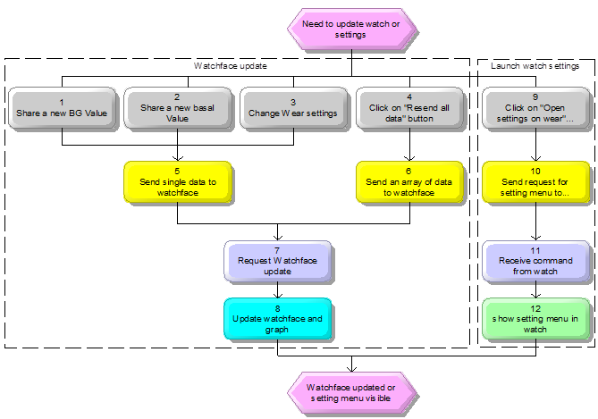
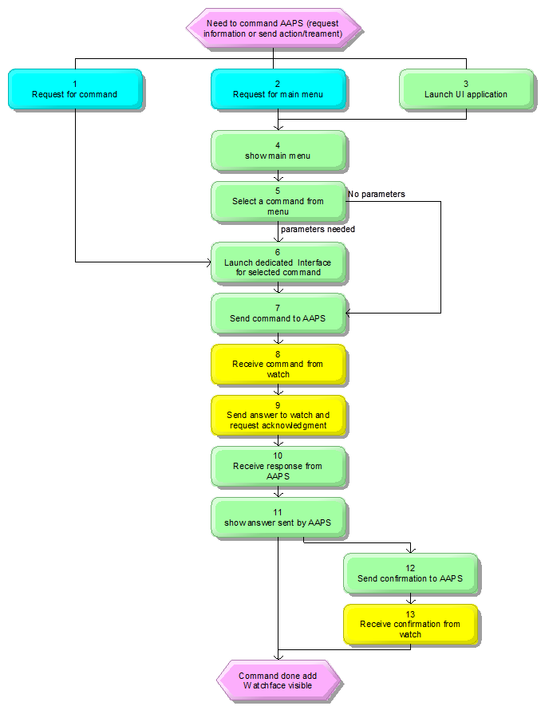
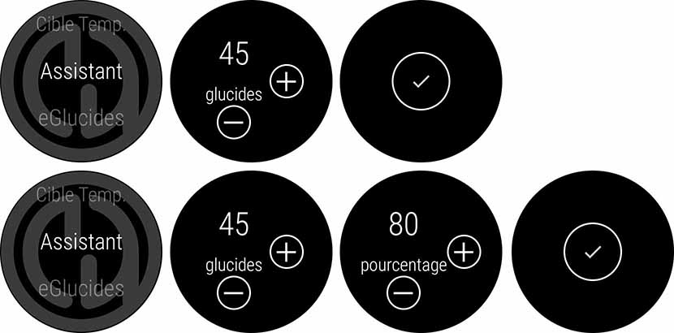
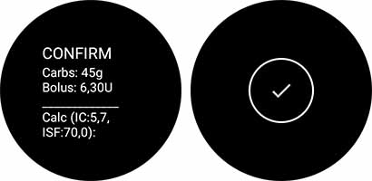
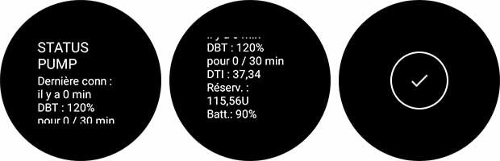

# Usefull informations

[TOC]

## Watch Settings and Tizen Watch distribution

It may seem surprising to put these 2 subjects in the introduction of the data structure exchanged between AAPS and TizenWatch, but these 2 subjects may impact Jobshare between AAPS and the watch ...

### Distribution impacts

1. Distribution via Github

- We can do what we want, no constraints for development

- The most complicated for end users to install Tizen watch, and for us to describe how to do
  - Just have a look to remember how install of AndroidStudio is explained [Here](https://androidaps.readthedocs.io/en/latest/EN/Installing-AndroidAPS/Building-APK.html), we will have to do the same thing for Visual Studio, Xamarin, nuget addons, Samsung certificate, ...

2. Distribution via Samsung/Tizen Store 

- The easiest way for end users to install Tizen watchface(s) and Wearable app... but
- Tizen Stare has combination policy for multi-project application: (see [**this link**](https://developer.tizen.org/ko/development/training/native-application/application-development-process?langredirect=1)), I will ask to samsung if for thier staore they have this kind of policy...

| **Note**Tizen has limited a multi-project application combination policy for device usability. If you do not follow the policy, the submission of your application to the Tizen Store can be rejected. |
| ------------------------------------------------------------ |
| For your convenience, some policies can be allowed in the Tizen Studio only. For example, you can make a STANDALONE service application or STANDALONE widget application in the Tizen Studio, but these applications can be rejected in the Tizen Store. |

- According to this policy we can't have Watchface and UI application in the same package
  - dedicated package for watchface(s). and Watchface settings have to be done in Android APS
  - 

## How it works

### Watchface update flowchart and description



| **N°** | **Description**                                              | **Module**                                 |
| ------ | ------------------------------------------------------------ | ------------------------------------------ |
| **1**  | **Share a new BG Value** <br />Triggered by new BG value received from  plugins | AAPS Plugin                                |
| **2**  | **Share a new basal Value**  <br />Triggered by new basal value received  from plugins | AAPS Plugin                                |
| **3**  | **Change Wear settings**  <br />In Wear plugin, some watchface settings  are available in AAPS (ie CSF, detailed IOB, ...) and other settings are in  watch.  => If you change settings in AAPS, it  updates watchface | AAPS UI                                    |
| **4**  | **Click on "Resend all data" button**  <br />This button (in Wear Plugin) allow user  to refresh all data in watchface (usefull when you first connect your watch,  in that case graph only contains basal data, and only last BG value, you can  resend all BG value for graph) | AAPS UI                                    |
| **5**  | **Send single data to watchface**  <br />There is only the last BG point sent  every 5 minutes (probably to have a shorter communication and less  consumption) | WatchUpdaterService,   TizenUpdaterService |
| **6**  | **Send an array of data to watchface**  <br />The data structure is different to  include all BG values for the last 5 hours) | WatchUpdaterService,   TizenUpdaterService |
| **7**  | **Request Watchface update**  <br />On single data received, all informations  of watchface are updated, basal rates are updated in graph, and the last BG  value is added in graph.  When an array of data is received, it  also updates all the BG points in the graph | Tizen Service,   WearOS Service            |
| **8**  | **Update watchface and graph**  <br />Update watchface and graph (at least  every 5 minutes...) | Watchface                                  |
| **9**  | **Click on "Open settings on wear" button**  <br />This button (in Wear Plugin) allow user  to launch setting menu in watch | AAPS UI                                    |
| **10** | **Send request for setting menu to watchface**  <br />Send a message to watch to request  settings menu | WatchUpdaterService,   TizenUpdaterService |
| **11** | **Receive command from watch**  <br />Request (Control Command) settings screen  in UI App. | Tizen Service,   WearOS Service            |
| **12** | **show setting menu in watch**  <br />Show Setting menu included in Tizen or  WearOS AAPS UI Application | UI App                                     |


### Command flowchart and description



| **N°** | **Description**                                              | **Module**                                 |
| ------ | ------------------------------------------------------------ | ------------------------------------------ |
| **1**  | **Request for command**  <br />Not available today in current wearOS watchface  I made a [PR #2404](https://github.com/MilosKozak/AndroidAPS/pull/2404)  to allow this functionality with up to 5 areas available (Up, Down, Left,  Right and Center)  => In my PR, you can select for each  area which command is affected (settings in watch).  => All background is available for  access to main menu  => Chart is "reserved" for  time scaling (that's why in some watchfaces you have only 4 areas available) | Watchface                                  |
| **2**  | **Request for main menu**  <br />It's the current access on wear OS to  dedicated commands (double tap on BG value, generally on top of watchface) | Watchface                                  |
| **3**  | **Launch UI application**                                    | TizenOS                                    |
| **4**  | **show main menu**  <br />You can access from this menu to:  - Commands (i.e. Bolus, eCarbs, Wizard,  Temp Target, …)  - Settings (i.e. watchface settings, main  menu settings, interface settings)  - Status (Loop, pump, CPP, TDI) | UI App                                     |
| **5**  | **Select a command from menu**  <br />If parameters are needed for selected  command, go to next step, otherwise go directly to step 7 | UI App                                     |
| **6**  | **Launch dedicated Interface  for selected command**  <br />User can enter different parameters  (according to selected command)  - eCarbs command: Carbs (g), start time  (min), duration (h)  - Bolus command: Insulin (U), Carbs (g)  - Wizard command: Carbs (g), percentage  (optional)  - TT command: Duration (min default 60),  Target (percentage)  - Profile switch (CPP): Time offset (h),  percentage  Different layout are available for UI in  wearOS, but I think we could make it easier on Tizen watch with rotary wheel  Slide left between each parameter  Finally there is a button ta validate  entries and send command | UI App                                     |
| **7**  | **Send command to AAPS**  <br />An async. formated message is broadcasted  to AAPS (including the command and parameters)  Once command is sent, User interface is  closed and watchface is shown again | Tizen Service,   WearOS Service            |
| **8**  | **Receive command from watch**  <br />Message is received and decoded to get  parameters.  If necessary request is done to other  plugin to get requested informations | WatchUpdaterService,   TizenUpdaterService |
| **9**  | **Send answer to watch and request acknowledgment**  <br />The response message is prepared based on  the command sent and the return of the plugins concerned.  In the case of treatment actions, an  acknowledgment is required to execute the action (bolus, carbs, TT ...) | WatchUpdaterService,   TizenUpdaterService |
| **10** | **Receive response from AAPS**  <br />An async. message is received by the  listener service which runs in the background in the watch.  The listener service launches a standard  user interface for showing the response and, if necessary, approve the  action. | Tizen Service,   WearOS Service            |
| **11** | **show answer sent by AAPS**  <br />Standard interface to show answer.  - if it's a status request (i.e. pump  status, loop status) then then "Check button on second sheet" is  just for closing UI and go back to watchface  - if it's a action command (i.e. Insulin,  Carbs, TT, ...) then the "Check button" is for sending an acknowledge  to AAPS and do action (Bolus, record Carbs...) | UI App                                     |
| **12** | **Send confirmation to AAPS**  <br />An async. formated message is broadcasted  to AAPS to confirm action | Tizen Service,   WearOS Service            |
| **13** | **Receive confirmation from watch**  <br />If acknowledge message is received by  AAPS, requested action is sent to dedicated plugin to be executed. | WatchUpdaterService,   TizenUpdaterService |

### Action interface on WearOS / Tizen and associated broadcasts

#### First example: Wizard action from watch (with acknowledge)

- When you select in main menu "Wizard" (Assistant in screenshot), you have 1 or 2 screens to enter parameters (percentage is optional, according to settings).

You enter Carbs amount (with +/- buttons), then swipe left between screen to enter the other parameters, until you reach the validation button.




- Watch send an "initiate action string" to AAPS (path "/nightscout_watch_initiateactionstring" on WearOS, channel "initiate action string", number xxx on Tizen watch) with string below: (note: to be confirmed in Tizen if plain text or if json string)

```
wizard2 45 100	(default interface without percentage parameter)
wizard2 45 80	(above example with percentage enable in settings)
```

- The request action received by xxxUpdaterService is sent as String to ActionStringHandler (see below)

- ActionStringHandler decode, assure interface with all other plugins, generate a standard answer (rTitle, rMessage and rAction) 
- This message is sent to watch threw a dataMap structure (WearOS), or JSON string (Tizen)



In above picture Title = CONFIRM, Message = Carbs: 45g, ...

Slide left (WearOS), to be decide according to interface in Tizen, tick button to confirm action

- Watch send a "confirm action string", which is decoded in ActionStringHandler, and if it matches with initiate action string and if it is within Timeout then action is done in AAPS.

#### Second example: Pump status request (without acknowledge)

- When you select in Main Menu > Status > "Pump" (Pompe in screenshot), (it's a simple command with no parameters, a resquest status is sent to AAPS:


Message sent:

```
status pump
```

- ActionStringHandler decode, request information to other plugins, and generate the same kind of answer than for wizard or any other action (with rTitle, rMessage, rAction)



Here Title = STATUS PUMP, message is longer and start with "Last conn: ..." (Dernière conn : ... in screenshot)

For long messages, you have to swipe up to see the bottom of message, and swipe left to reach the button that closes the screen.


## Data exchange

### Service configuration

#### accessoryservices.xml: (android side)

Note don't use @Strings/xxx in xml file (crash with )

id and name must be short (30 characters max in documentation but doesn't work if too close than limit).

=> Less than 20 characters preferable

- serviceProfile1 

  - id="/androidaps/tizen"
  - name="androidaps.tizen"
  - role="provider" or "consumer"
  - serviceImpl="info.nightscout.androidaps.plugins.general.wear.tizenintegration.TizenUpdaterService"
    - serviceChannel : 
      - 104 (for tests), 
      - other (see [AndroidAPS / Tizen interface specification](AAPS_Tizen_Interface_Specification.md)
  
  

#### Setting sap is very, very tricky:

- ServiceProfile
  - id
    - accessoryservices.xml

| Paramètre                      | Tizen Studio                                         | Android Studio                                    |
| ------------------------------ | ---------------------------------------------------- | ------------------------------------------------- |
| serviceProfile:id              | res/xml/Accessoryservices.xml                        | res/xml/Accessoryservices.xml                     |
| serviceProfile:id              | sap.c: (sap_agent_initialize())                      |                                                   |
| serviceProfile:name            | less than 20 characters                              | should be the same on both sides                  |
| serviceProfile:autoLaunchAppId | tizen-manifest:<br />ui-application appid            |                                                   |
| serviceProfile:serviceImpl     |                                                      | "com.xxxx.ServiceClass" (adress of Service class) |
| serviceProfile:role            | "provider"                                           | "consumer"                                        |
| Tizen main_filename.c          | sap.c (include main_filename.h)<br />main_filename.h |                                                   |
|                                |                                                      |                                                   |
|                                |                                                      |                                                   |

#### Received by TizenUpdaterService

Method: (sub class of ServiceConnection that extends SASocket)

```java
public void onReceive(int channelId, byte[] data)
```

```java
	String path = event.getPath();
```

```java
	String actionstring = new String(data);
```

Messages received from Action initiate channel or Action confirm channel are sent to ActionStringHandler

#### ActionStringHandler : Class of Wear plugin

methods:

1. **For build an answer after an Initiate action String sent by watch:**

```java
public synchronized static void handleInitiate(String actionstring)
```

Responses messages has always the same structure (3 strings with a title, a response and an action contains the action that watch should answer to confirm Action: 

```
WearPlugin.getPlugin().requestActionConfirmation(rTitle, rMessage, rAction);
```

Note: When an initiate Action String does not require a confirmation, rAction is set to statusmessage or info.

2. **For intent actions (only for fill, bolus, temptarget, wizard2, cppset, changeRequest and ecarb)**

```
public synchronized static void handleConfirmation(String actionString)
```


Note: action string is split in ActionStringHandler with regex "\\\s+"

| Keyword (act[0])    | 1rst param (act[1])                     | 2nd param (act[2])               | 3rd param (act[3])               | 4th param (act[4])       |
| ------------------- | --------------------------------------- | -------------------------------- | -------------------------------- | ------------------------ |
| fillpreset          | "1"<br />"2"<br />"3"                   |                                  |                                  |                          |
| fill                | amount<br />stringToDouble              |                                  |                                  |                          |
| bolus               | insulin<br />stringToDouble             | carbs<br />stringToDouble        |                                  |                          |
| temptarget          | isMGDL<br />parseBoolean                | duration<br />stringToInt        | low<br />stringToDouble          | high<br />stringToDouble |
| status              | "pump"<br />"loop"                      |                                  |                                  |                          |
| wizard2             | carbsBeforeConstraints<br />stringToInt | percentage<br />Integer.parseInt |                                  |                          |
| opencpp             |                                         |                                  |                                  |                          |
| cppset              | timeshift                               | percentage                       |                                  |                          |
| tddstats            |                                         |                                  |                                  |                          |
| ecarbs              | carbs<br />stringToInt                  | starttime (min)<br />stringToInt | duration (hour)<br />stringToInt |                          |
| changeRequest       |                                         |                                  |                                  |                          |
| cancelChangeRequest |                                         |                                  |                                  |                          |

Timeout : 65s

rTitle : Title of response (text)

rMessage : detailled answer (text)

rAction : action for acknowledge

```java
	WearPlugin.getPlugin().requestActionConfirmation(rTitle, rMessage, rAction)
```


```java
public synchronized static void handleConfirmation(String actionString)
```

action string split with regex "\\\s+"


## 