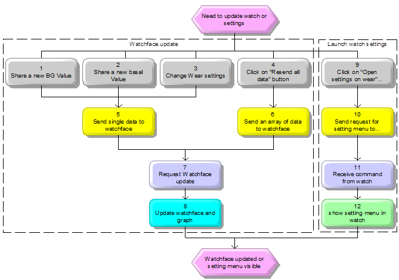
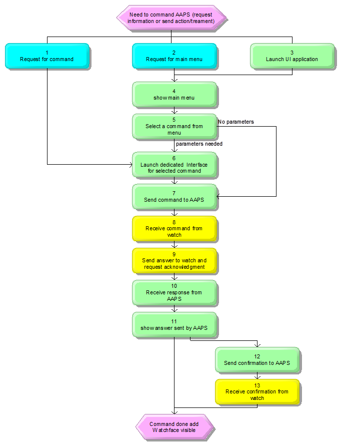

# AAPS - Tizen specification (draft)

## How it works

### Watchface update flowchart and description



| **N°** | **Description**                                              | **Module**                                 |
| ------ | ------------------------------------------------------------ | ------------------------------------------ |
| **1**  | **Share a new BG Value** <br />Triggered by new BG value received from  plugins | AAPS Plugin                                |
| **2**  | **Share a new basal Value**  <br />Triggered by new basal value received  from plugins | AAPS Plugin                                |
| **3**  | **Change Wear settings**  <br />In Wear plugin, some watchface settings  are available in AAPS (ie CSF, detailed IOB, ...) and other settings are in  watch.  => If you change settings in AAPS, it  updates watchface | AAPS UI                                    |
| **4**  | **Click on "Resend all data" button**  <br />This button (in Wear Plugin) allow user  to refresh all data in watchface (usefull when you first connect your watch,  in that case graph only contains basal data, and only last BG value, you can  resend all BG value for graph) | AAPS UI                                    |
| **5**  | **Send single data to watchface**  <br />There is only the last BG point sent  every 5 minutes (probably to have a shorter communication and less  consumption) | WatchUpdaterService,   TizenUpdaterService |
| **6**  | **Send an array of data to watchface**  <br />The data structure is different to  include all BG values for the last 5 hours) | WatchUpdaterService,   TizenUpdaterService |
| **7**  | **Request Watchface update**  <br />On single data received, all informations  of watchface are updated, basal rates are updated in graph, and the last BG  value is added in graph.  When an array of data is received, it  also updates all the BG points in the graph | Tizen Service,   WearOS Service            |
| **8**  | **Update watchface and graph**  <br />Update watchface and graph (at least  every 5 minutes...) | Watchface                                  |
| **9**  | **Click on "Open settings on wear" button**  <br />This button (in Wear Plugin) allow user  to launch setting menu in watch | AAPS UI                                    |
| **10** | **Send request for setting menu to watchface**  <br />Send a message to watch to request  settings menu | WatchUpdaterService,   TizenUpdaterService |
| **11** | **Receive command from watch**  <br />Request (Control Command) settings screen  in UI App. | Tizen Service,   WearOS Service            |
| **12** | **show setting menu in watch**  <br />Show Setting menu included in Tizen or  WearOS AAPS UI Application | UI App                                     |


### Command flowchart and description



| **N°** | **Description**                                              | **Module**                                 |
| ------ | ------------------------------------------------------------ | ------------------------------------------ |
| **1**  | **Request for command**  <br />Not available today in current wearOS watchface  I made a [PR #2404](https://github.com/MilosKozak/AndroidAPS/pull/2404)  to allow this functionality with up to 5 areas available (Up, Down, Left,  Right and Center)  => In my PR, you can select for each  area which command is affected (settings in watch).  => All background is available for  access to main menu  => Chart is "reserved" for  time scaling (that's why in some watchfaces you have only 4 areas available) | Watchface                                  |
| **2**  | **Request for main menu**  <br />It's the current access on wear OS to  dedicated commands (double tap on BG value, generally on top of watchface) | Watchface                                  |
| **3**  | **Launch UI application**                                    | TizenOS                                    |
| **4**  | **show main menu**  <br />You can access from this menu to:  - Commands (i.e. Bolus, eCarbs, Wizard,  Temp Target, …)  - Settings (i.e. watchface settings, main  menu settings, interface settings)  - Status (Loop, pump, CPP, TDI) | UI App                                     |
| **5**  | **Select a command from menu**  <br />If parameters are needed for selected  command, go to next step, otherwise go directly to step 7 | UI App                                     |
| **6**  | **Launch dedicated Interface  for selected command**  <br />User can enter different parameters  (according to selected command)  - eCarbs command: Carbs (g), start time  (min), duration (h)  - Bolus command: Insulin (U), Carbs (g)  - Wizard command: Carbs (g), percentage  (optional)  - TT command: Duration (min default 60),  Target (percentage)  - Profile switch (CPP): Time offset (h),  percentage  Different layout are available for UI in  wearOS, but I think we could make it easier on Tizen watch with rotary wheel  Slide left between each parameter  Finally there is a button ta validate  entries and send command | UI App                                     |
| **7**  | **Send command to AAPS**  <br />An async. formated message is broadcasted  to AAPS (including the command and parameters)  Once command is sent, User interface is  closed and watchface is shown again | Tizen Service,   WearOS Service            |
| **8**  | **Receive command from watch**  <br />Message is received and decoded to get  parameters.  If necessary request is done to other  plugin to get requested informations | WatchUpdaterService,   TizenUpdaterService |
| **9**  | **Send answer to watch and request acknowledgment**  <br />The response message is prepared based on  the command sent and the return of the plugins concerned.  In the case of treatment actions, an  acknowledgment is required to execute the action (bolus, carbs, TT ...) | WatchUpdaterService,   TizenUpdaterService |
| **10** | **Receive response from AAPS**  <br />An async. message is received by the  listener service which runs in the background in the watch.  The listener service launches a standard  user interface for showing the response and, if necessary, approve the  action. | Tizen Service,   WearOS Service            |
| **11** | **show answer sent by AAPS**  <br />Standard interface to show answer.  - if it's a status request (i.e. pump  status, loop status) then then "Check button on second sheet" is  just for closing UI and go back to watchface  - if it's a action command (i.e. Insulin,  Carbs, TT, ...) then the "Check button" is for sending an acknowledge  to AAPS and do action (Bolus, record Carbs...) | UI App                                     |
| **12** | **Send confirmation to AAPS**  <br />An async. formated message is broadcasted  to AAPS to confirm action | Tizen Service,   WearOS Service            |
| **13** | **Receive confirmation from watch**  <br />If acknowledge message is received by  AAPS, requested action is sent to dedicated plugin to be executed. | WatchUpdaterService,   TizenUpdaterService |


## Android Wear plugin

to be completed


## Tizen package structure

### Samsung documentation

to be completed

### .net (Visual Studio and Xamarin plugin)

to be completed


### native (Tizen Studio)

- You can not package an UI app with watch app. Go through the **Table: Combinations** in [**this link**](https://developer.tizen.org/ko/development/training/native-application/application-development-process?langredirect=1) to know about possible packaging combinations in detail.
  - UI App can include Service and Widget sub-project
  - Watchface can only include Service sub-project
- To develop multi-packaged project in Tizen, you may follow **Developing Multiple Projects as a Combined Package** section in **[this link](https://developer.tizen.org/development/training/native-application/application-development-process#develop)**.
- To do communication between android app and Tizen app please go through **Build your First Companion type application** section in **[this link](https://developer.samsung.com/galaxy-watch/develop/creating-your-first-app)**.
- To debug your application, you may try various application debugging methods e.g. debugging with logs as described in **[this link](https://developer.tizen.org/ko/development/training/native-application/application-development-process/debugging-applications?langredirect=1#methods)**.
- You may try creating another app to enter Carbs quantity, Insulin Quantity, etc data and launch it from watchface app. In that case, you may follow **[this link](https://developer.tizen.org/development/guides/native-application/application-management/application-controls)**. 
  - this describe how we can launch (through **Application Control**) UI commands from service (when AAPS request acknowledge from watch) or from a watchface (when we want to launch a command)


## Data exchange

### Watchface data

to be completed (keyword, data structure)

### List of commands

to be completed (keyword, data structure)

#### Command received by TizenUpdaterService

Method:

```
public void onReceive(int channelID, byte[] data)
```


#### Command received by WatchUpdaterService

Method:

```java
public void onMessageReceived(MessageEvent event)
```

```java
	String path = event.getPath();
```

```java
	String actionstring = new String(event.getData());
```


| Path                                                         | Action                                               |
| ------------------------------------------------------------ | ---------------------------------------------------- |
| WEARABLE_RESEND_PATH = "/nightscout_watch_data_resend"       | resendData()                                         |
| WEARABLE_CANCELBOLUS_PATH = "/nightscout_watch_cancel_bolus" | cancelBolus()                                        |
| WEARABLE_INITIATE_ACTIONSTRING_PATH = "/nightscout_watch_initiateactionstring" | ActionStringHandler.handleInitiate(actionstring)     |
| WEARABLE_CONFIRM_ACTIONSTRING_PATH = "/nightscout_watch_confirmactionstring" | ActionStringHandler.handleConfirmation(actionstring) |

#### ActionStringHandler : Class of Wear plugin

method

```
public synchronized static void handleInitiate(String actionstring)
```

action string split with regex "\\\s+"

| Keyword (act[0])      | 1rst param (act[1])                  | 2nd param (act[2])            |                              |                       |
| --------------------- | ------------------------------------ | ----------------------------- | ---------------------------- | --------------------- |
| "fillpreset"          | "1"<br />"2"<br />"3"                |                               |                              |                       |
| "fill"                | amount (SafeParse.stringToDouble)    |                               |                              |                       |
| "bolus"               | insulin (stringToDouble)             | carbs (stringToDouble)        |                              |                       |
| "temptarget"          | isMGDL (parseBoolean)                | duration (stringToInt)        | low (stringToDouble)         | high (stringToDouble) |
| "status"              | "pump"<br />"loop"                   |                               |                              |                       |
| "wizard2"             | carbsBeforeConstraints (stringToInt) | percentage (Integer.parseInt) |                              |                       |
| "opencpp"             |                                      |                               |                              |                       |
| "cppset"              | timeshift                            | percentage                    |                              |                       |
| "tddstats"            |                                      |                               |                              |                       |
| "ecarbs"              | carbs (stringToInt)                  | starttime (min)(stringToInt)  | duration (hour)(stringToInt) |                       |
| "changeRequest"       |                                      |                               |                              |                       |
| "cancelChangeRequest" |                                      |                               |                              |                       |

Timeout : 65s

rTitle : Title of response (text)

rMessage : detailled answer (text)

rAction : action for acknowledge

```java
	WearPlugin.getPlugin().requestActionConfirmation(rTitle, rMessage, rAction)
```


```
public synchronized static void handleConfirmation(String actionString)
```

action string split with regex "\\\s+"


## Settings

To be decide if we include watchface settings (background color, hidden or visible informations, ...) in UI application in watch, or in AAPS wear plugin (dedicated screen prepared but empty today).

At least we need an setting menu in UI application for user interface (which command is available in main menu)


## 